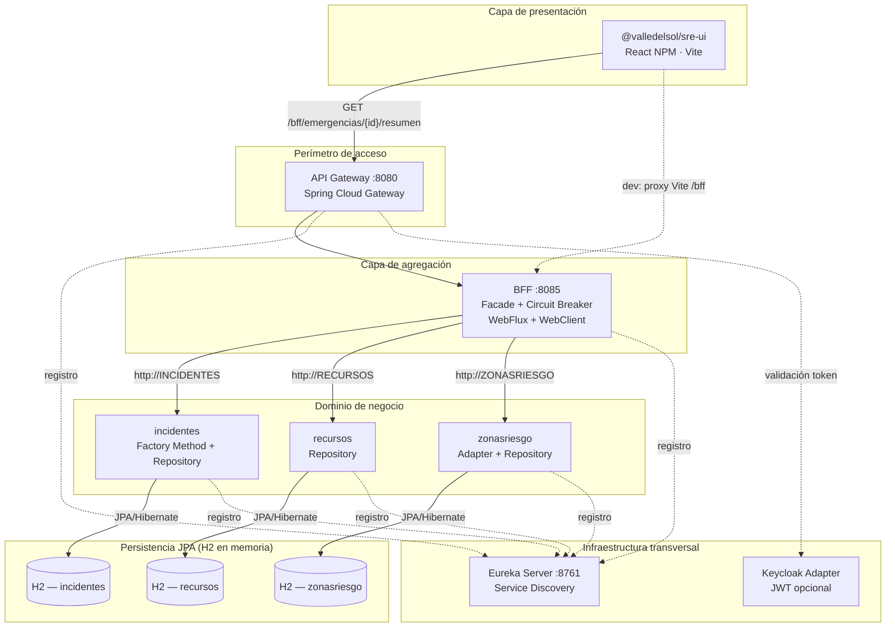
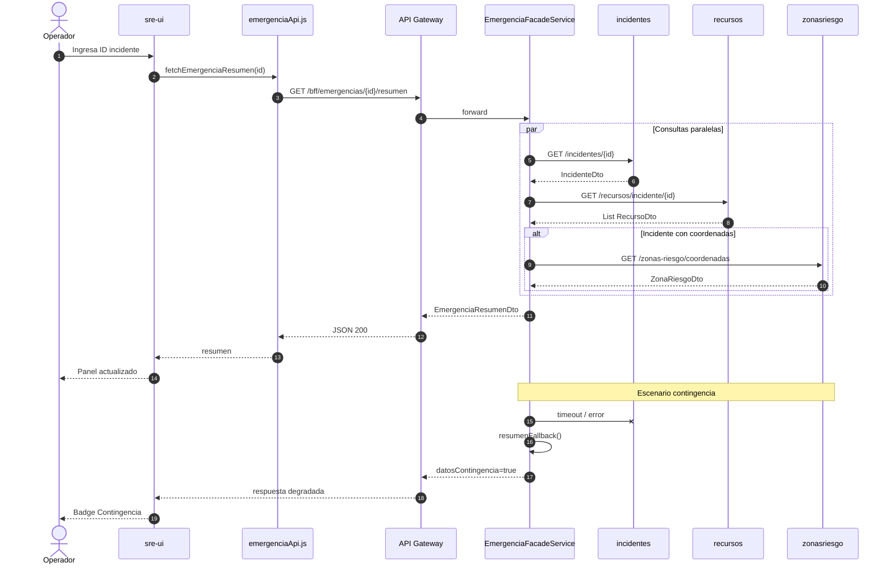
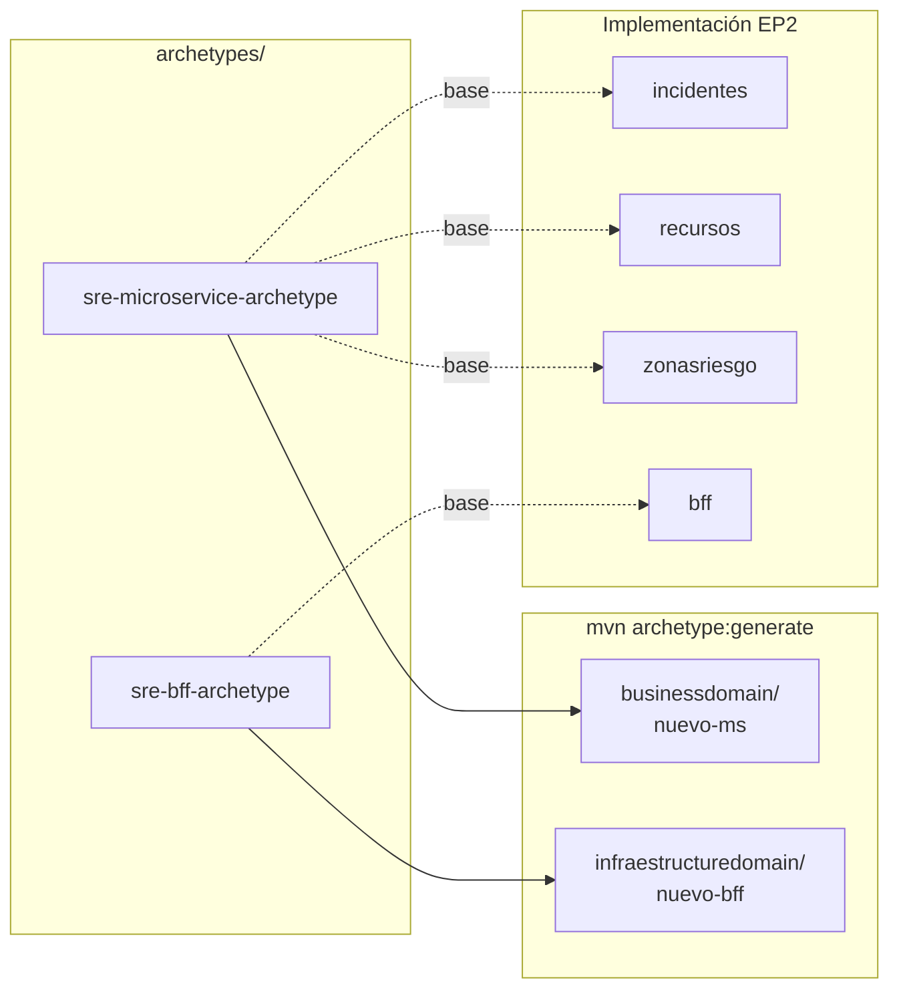
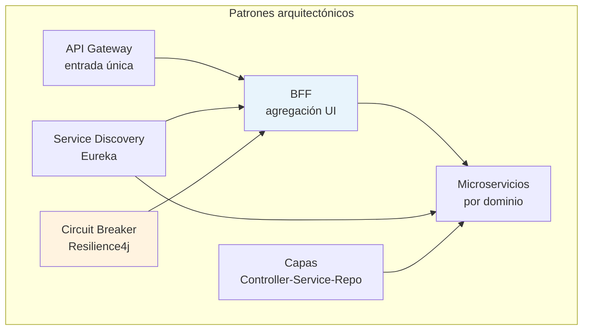
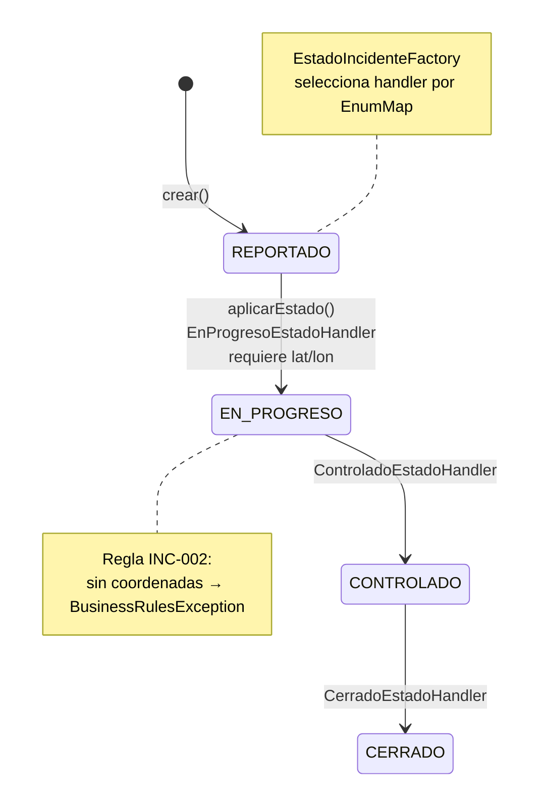
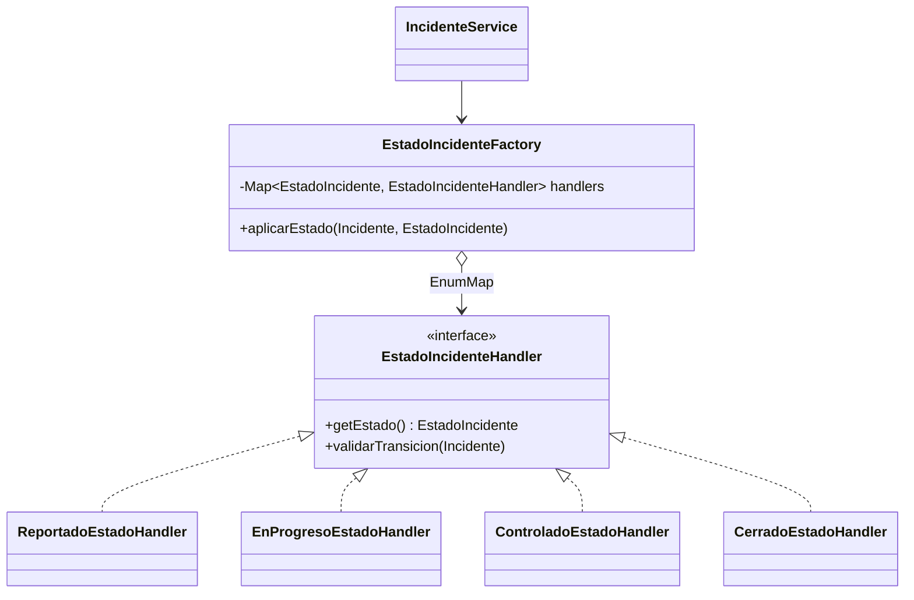
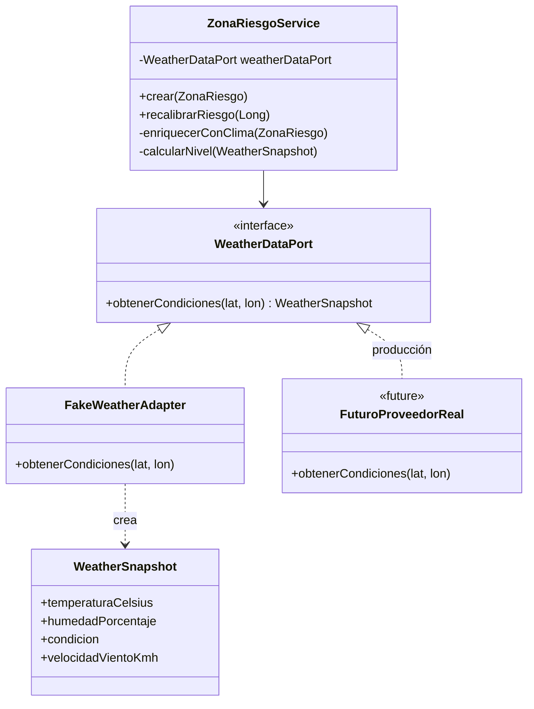
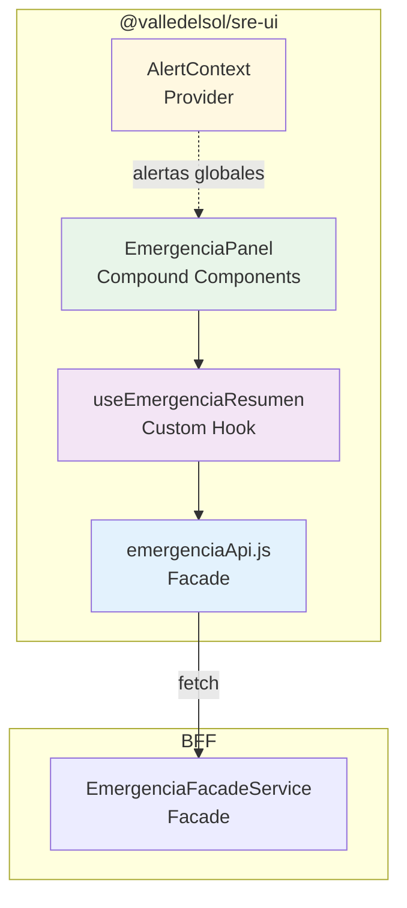
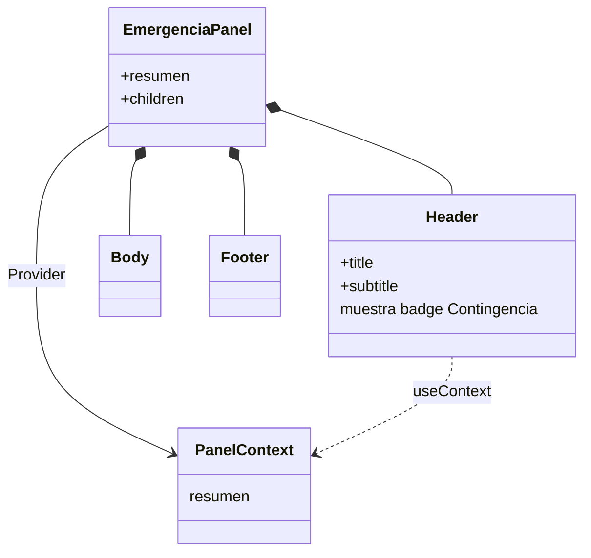
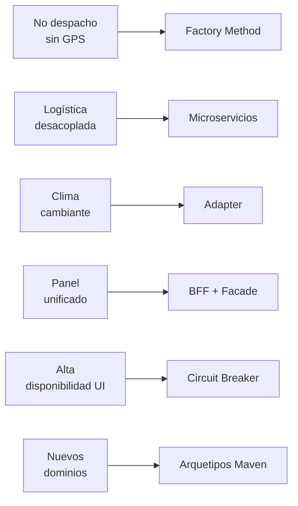

<style>
  /* Tipografía global — informe de ingeniería */
  html, body {
    font-family: Arial, Helvetica, sans-serif !important;
    font-size: 12pt !important;
    line-height: 1.5 !important;
    color: #1a1a1a;
  }
  p, li, td, th, blockquote, code, pre, span, div, a {
    font-family: Arial, Helvetica, sans-serif !important;
    font-size: 12pt !important;
    line-height: 1.5 !important;
  }
  h1, h2, h3, h4, h5, h6 {
    font-family: Arial, Helvetica, sans-serif !important;
    line-height: 1.3 !important;
    color: #111827;
  }
  h1 { font-size: 22pt !important; }
  h2 { font-size: 16pt !important; margin-top: 1.4em; }
  h3 { font-size: 13pt !important; }

  /* Logo municipalidad — esquina superior derecha en todas las páginas */
  .logo-municipalidad-fijo {
    position: fixed;
    top: 10mm;
    right: 10mm;
    height: 40px;
    width: auto;
    z-index: 9999;
    opacity: 0.92;
  }

  /* Margen de cuerpo para no solapar el logo fijo */
  body {
    padding-top: 14mm;
    padding-right: 4mm;
    padding-left: 4mm;
  }

  /* Portada */
  .portada {
    text-align: center;
    page-break-after: always;
    break-after: page;
    min-height: 85vh;
    display: flex;
    flex-direction: column;
    justify-content: center;
    align-items: center;
    padding: 2rem 1.5rem 3rem;
    margin-top: 2rem;
  }
  .portada .logo-duoc {
    height: 150px;
    width: auto;
    max-width: 80%;
    object-fit: contain;
    margin-bottom: 2.5rem;
  }
  .portada h1 {
    font-size: 24pt !important;
    margin: 0.5rem 0 0.75rem;
    border: none;
  }
  .portada h2 {
    font-size: 14pt !important;
    font-weight: normal;
    color: #374151;
    margin: 0.25rem 0 1.5rem;
  }
  .portada h3 {
    font-size: 12pt !important;
    font-weight: normal;
    color: #4b5563;
    margin-bottom: 2rem;
  }
  .portada .metadatos {
    font-size: 12pt !important;
    line-height: 1.6 !important;
    margin-top: 1rem;
  }
  .portada .metadatos p {
    margin: 0.35rem 0;
  }

  /* Salto de página explícito */
  .salto-pagina {
    page-break-after: always;
    break-after: page;
  }

  /* Índice */
  .indice {
    page-break-after: always;
    break-after: page;
  }
  .indice ol {
    padding-left: 1.4rem;
  }
  .indice li {
    margin: 0.4rem 0;
  }

  /* Tablas — ancho completo y estilo profesional */
  table {
    width: 100% !important;
    max-width: 100%;
    border-collapse: collapse;
    margin: 1rem 0 1.25rem;
    font-size: 11pt !important;
    table-layout: auto;
  }
  th, td {
    border: 1px solid #c8c8c8;
    padding: 8px 10px;
    text-align: left;
    vertical-align: top;
    word-wrap: break-word;
  }
  th {
    background-color: #eef2f7;
    color: #1f2937;
    font-weight: 600;
  }
  tr:nth-child(even) td {
    background-color: #fafbfc;
  }

  /* Impresión / PDF */
  @page {
    margin: 18mm 15mm 20mm 15mm;
  }
  @media print {
    .logo-municipalidad-fijo {
      position: fixed;
      top: 8mm;
      right: 8mm;
    }
    .portada {
      page-break-after: always;
    }
    table {
      page-break-inside: avoid;
    }
    h2, h3 {
      page-break-after: avoid;
    }
  }
</style>

<!-- Logo municipalidad visible en todas las hojas -->


<!-- ========== PORTADA ========== -->
<div class="portada">


<h1>Informe EV2 — Análisis de Patrones y Arquetipos</h1>
<h2>Sistema de Respuesta de Emergencias (SRE) — Municipalidad Valle del Sol</h2>
<h3>Evaluación Parcial N°2 — Encargo · DSY1106 Desarrollo Fullstack III</h3>

<div class="metadatos">
  <p><strong>Proyecto:</strong> SRE-ValleDeSol</p>
  <p><strong>Integrantes:</strong> Skarlett Tropan, Ari Araya</p>
  <p><strong>Fecha de entrega:</strong> 5 de junio de 2026</p>
  <p><strong>Repositorio:</strong> https://github.com/KhanIvall/SRE-ValleDeSol</p>
</div>

</div>

<div class="salto-pagina"></div>

## Tabla de contenidos

<div class="indice">

1. [Introducción](#1-introducción)
2. [Visión arquitectónica de la solución](#2-visión-arquitectónica-de-la-solución)
3. [Arquetipos Maven](#3-arquetipos-maven)
4. [Patrones arquitectónicos](#4-patrones-arquitectónicos)
5. [Patrones de diseño — Backend](#5-patrones-de-diseño--backend)
6. [Patrones de diseño — Frontend (NPM)](#6-patrones-de-diseño--frontend-npm)
7. [Trazabilidad requisitos SRE → decisiones técnicas](#7-trazabilidad-requisitos-sre--decisiones-técnicas)
8. [Buenas prácticas y evidencia de calidad](#8-buenas-prácticas-y-evidencia-de-calidad)
9. [Conclusiones](#9-conclusiones)
10. [Referencias técnicas](#10-referencias-técnicas)
11. [Anexos — Diagramas Mermaid](#11-anexos--diagramas-mermaid)

</div>

---

## 1. Introducción

### 1.1 Propósito del documento

El presente informe documenta el análisis, la selección y la implementación de **patrones de diseño**, **arquetipos Maven** y **patrones arquitectónicos** aplicados al Sistema de Respuesta de Emergencias (SRE) de la Municipalidad Valle del Sol, desarrollado en continuidad con el caso de la Evaluación Parcial 1.

El documento responde a los indicadores de la rúbrica que exigen:

- Al menos **tres patrones de diseño** en frontend y backend, con justificación del problema que resuelven (Indicador 1).
- Uso coherente de **arquetipos** y arquitectura **BFF + microservicios**, demostrando escalabilidad y eficiencia (Indicador 2).

### 1.2 Contexto del negocio (continuidad EP1)

El SRE centraliza la gestión operativa de emergencias municipales. Los operadores requieren:

- Registrar y actualizar **incidentes** con ciclo de vida controlado (reportado → en progreso → controlado → cerrado).
- Asignar **recursos** (brigadas, vehículos, equipos) sin acoplar bases de datos entre dominios.
- Evaluar **zonas de riesgo** según ubicación y condiciones climáticas.
- Visualizar en un **panel único** el resumen agregado (incidente + recursos + riesgo), tolerante a fallas parciales del backend.

La solución técnica descompone estos dominios en microservicios autónomos, los expone mediante un **BFF** orientado al frontend NPM y unifica el acceso externo con **API Gateway** y **descubrimiento de servicios (Eureka)**.

### 1.3 Alcance del análisis

| Capa | Componentes analizados |
|------|------------------------|
| Frontend NPM | `@valledelsol/sre-ui` (`frontend/sre-ui`) |
| Backend | BFF (`infraestructuredomain/bff`), microservicios `incidentes`, `recursos`, `zonasriesgo` |
| Arquetipos | `sre-microservice-archetype`, `sre-bff-archetype` |
| Infraestructura de soporte | Eureka, API Gateway (contexto arquitectónico) |

---

## 2. Visión arquitectónica de la solución

### 2.1 Estilo arquitectónico general

Se adopta una **arquitectura de microservicios** con los siguientes principios:

1. **Bounded contexts** alineados al dominio: incidentes, recursos, zonas de riesgo.
2. **Persistencia desacoplada**: `recursos` referencia `incidenteAsignadoId` sin clave foránea inter-servicio.
3. **Agregación en el BFF**: el frontend no orquesta múltiples llamadas REST; consume un único contrato.
4. **Punto de entrada único**: API Gateway en puerto 8080.
5. **Resiliencia**: Circuit Breaker en el BFF con respuesta de contingencia.

### 2.2 Diagrama de contexto y contenedores

El siguiente diagrama ilustra la topología de despliegue y las relaciones entre capas.



### 2.3 Flujo crítico: resumen de emergencia

1. El operador ingresa un ID de incidente en el panel React.
2. `emergenciaApi.js` (patrón **Facade**) invoca `GET /bff/emergencias/{id}/resumen` vía Gateway.
3. `EmergenciaFacadeService` consulta en paralelo (WebClient reactivo) incidente, recursos y zona de riesgo.
4. Ante fallo o timeout, Resilience4j ejecuta `resumenFallback`, marcando `datosContingencia: true`.
5. `useEmergenciaResumen` y `EmergenciaPanel` presentan el resultado, incluyendo el badge de contingencia.

### 2.4 Diagrama de secuencia — flujo nominal y contingencia



---

## 3. Arquetipos Maven

### 3.1 Justificación del uso de arquetipos

La evaluación exige componentes backend generados desde **arquetipos Maven** para garantizar:

- Estructura homogénea (capas, paquetes, dependencias).
- Reducción de errores al incorporar nuevos servicios.
- Coherencia con el monorepo `sre-parent`.

### 3.2 Arquetipo `sre-microservice-archetype`

| Atributo | Detalle |
|----------|---------|
| **Propósito** | Plantilla Spring Boot + JPA + Eureka + Controller / Service / Repository |
| **Uso en el proyecto** | Base conceptual de `incidentes`, `recursos`, `zonasriesgo` |
| **Propiedades clave** | `serviceName`, `applicationClass`, `entityName`, `package` |
| **Estructura generada** | `controller/`, `service/`, `repository/`, `entities/`, `common/`, `exception/` |

**Beneficio para el SRE:** cada nuevo dominio municipal (por ejemplo, alertas ciudadanas) puede generarse en `businessdomain/` con el mismo contrato operativo y registrarse en Eureka sin redefinir el esqueleto del proyecto.

### 3.3 Arquetipo `sre-bff-archetype`

| Atributo | Detalle |
|----------|---------|
| **Propósito** | Plantilla WebFlux + Eureka + WebClient + Resilience4j |
| **Uso en el proyecto** | Base del módulo `bff` (`EmergenciaFacadeService`) |
| **Propiedades clave** | `bffPort`, `serviceName`, `applicationClass` |

**Beneficio para el SRE:** estandariza agregadores orientados al panel React, con resiliencia incorporada desde el primer despliegue.

### 3.4 Relación arquetipo → componente implementado

| Componente | Arquetipo base | Evidencia en repositorio |
|------------|----------------|--------------------------|
| `incidentes` | `sre-microservice-archetype` | Capas + entidad `Incidente` + Eureka |
| `recursos` | `sre-microservice-archetype` | Misma estructura; dominio logístico |
| `zonasriesgo` | `sre-microservice-archetype` | Extensión con capa `adapter/` |
| `bff` | `sre-bff-archetype` | `facade/`, WebClient, `@CircuitBreaker` |

### 3.5 Diagrama — generación desde arquetipos



---

## 4. Patrones arquitectónicos

### 4.1 Microservicios por dominio

| Microservicio | Responsabilidad | Escalabilidad |
|---------------|-----------------|---------------|
| `incidentes` | Ciclo de vida y reglas de transición de estado | Escala independiente ante picos de reportes |
| `recursos` | Inventario y asignación logística | Escala según operaciones de despacho |
| `zonasriesgo` | Análisis territorial y clima | Escala según carga de consultas geoespaciales |

**Coherencia:** cada servicio expone API REST propia, se registra en Eureka y mantiene su modelo de datos.

### 4.2 Backend For Frontend (BFF)

El BFF resuelve el *impedance mismatch* entre el panel React (un DTO de resumen) y tres APIs de dominio heterogéneas. Centraliza orquestación paralela, mapeo a `EmergenciaResumenDto` y políticas de degradación.

### 4.3 API Gateway

Spring Cloud Gateway actúa como fachada de infraestructura con rutas `/bff/**`, `/incidentes/**`, `/recursos/**`, `/zonas-riesgo/**` hacia instancias Eureka. Permite añadir autenticación JWT sin modificar microservicios.

### 4.4 Service Discovery (Eureka)

Elimina URLs fijas en clientes; el BFF resuelve `http://INCIDENTES`, `http://RECURSOS`, `http://ZONASRIESGO` por nombre lógico.

### 4.5 Circuit Breaker (Resilience4j)

Patrón de tolerancia a fallos en el BFF. Si un microservicio no responde, el operador recibe datos de contingencia en lugar de un error opaco.

### 4.6 Arquitectura en capas (por microservicio)

Patrón estructural transversal: `Controller → Service → Repository → Entidad JPA`. Separa transporte HTTP, reglas de negocio y persistencia.

### 4.7 Diagrama — patrones arquitectónicos en el SRE



---

## 5. Patrones de diseño — Backend

Se implementan **cuatro patrones de diseño** verificables en código, superando el mínimo de tres exigido por la rúbrica.

### 5.1 Factory Method — Microservicio `incidentes`

| Aspecto | Descripción |
|---------|-------------|
| **Ubicación** | `EstadoIncidenteFactory`, `EstadoIncidenteHandler`, handlers por estado |
| **Problema** | Las transiciones de estado tienen reglas distintas; un `switch` centralizado viola OCP y dificulta el mantenimiento |
| **Solución** | La factory delega en un handler por `EstadoIncidente`; Spring inyecta la lista y la factory los indexa en `EnumMap` |
| **Mantenibilidad** | Agregar un estado implica un nuevo `@Component` handler sin modificar la factory |
| **Regla SRE** | Código `INC-002`: coordenadas obligatorias antes de `EN_PROGRESO` |

**Evidencia:** `businessdomain/incidentes/src/main/java/com/valledelsol/incidentes/factory/`

### 5.2 Diagrama — máquina de estados del incidente (Factory Method)



### 5.3 Diagrama — estructura Factory Method (clases)



### 5.4 Adapter — Microservicio `zonasriesgo`

| Aspecto | Descripción |
|---------|-------------|
| **Ubicación** | `WeatherDataPort`, `FakeWeatherAdapter`, `ZonaRiesgoService` |
| **Problema** | El proveedor climático puede cambiar; el dominio no debe depender de un SDK concreto |
| **Solución** | El servicio depende del puerto; el adaptador traduce la fuente externa a `WeatherSnapshot` |
| **Escalabilidad** | Otro adaptador con `sre.weather.adapter=real` sin alterar el servicio |

**Evidencia:** `businessdomain/zonasriesgo/src/main/java/com/valledelsol/zonasriesgo/adapter/`

### 5.5 Diagrama — patrón Adapter (clima)



### 5.6 Facade — BFF

| Aspecto | Descripción |
|---------|-------------|
| **Ubicación** | `EmergenciaFacadeService` |
| **Problema** | El frontend requeriría tres llamadas, manejo de errores parciales y ensamblado manual |
| **Solución** | Fachada `obtenerResumen(incidenteId)` oculta WebClient y `Mono.zip` |
| **Eficiencia** | Consultas paralelas reducen latencia en el panel |

**Evidencia:** `infraestructuredomain/bff/src/main/java/com/valledelsol/bff/facade/`

### 5.7 Repository — Microservicios

| Aspecto | Descripción |
|---------|-------------|
| **Ubicación** | `IncidenteRepository`, `RecursoRepository`, `ZonaRiesgoRepository` |
| **Problema** | El servicio no debe contener SQL ni detalles de persistencia |
| **Solución** | Spring Data JPA con métodos semánticos de dominio |

### 5.8 Tabla resumen — Backend

| Patrón | Componente | Problema resuelto |
|--------|------------|-------------------|
| Factory Method | `incidentes` | Reglas de transición extensibles |
| Adapter | `zonasriesgo` | Integración climática intercambiable |
| Facade | `bff` | Agregación simplificada para UI |
| Repository | los 3 MS | Separación persistencia / negocio |

---

## 6. Patrones de diseño — Frontend (NPM)

Se implementan **cuatro patrones** en `@valledelsol/sre-ui`.

### 6.1 Facade — `emergenciaApi.js`

| Aspecto | Descripción |
|---------|-------------|
| **Problema** | Los componentes no deben conocer URLs ni headers JWT |
| **Solución** | `fetchEmergenciaResumen(incidenteId)` centraliza HTTP al BFF |

**Evidencia:** `frontend/sre-ui/src/services/emergenciaApi.js`

### 6.2 Provider (Context) — `AlertContext.jsx`

| Aspecto | Descripción |
|---------|-------------|
| **Problema** | Alertas globales sin prop drilling |
| **Solución** | `AlertProvider` + `useAlert()` con `publicar` / `descartar` |

**Evidencia:** `frontend/sre-ui/src/context/AlertContext.jsx`

### 6.3 Compound Components — `EmergenciaPanel.jsx`

| Aspecto | Descripción |
|---------|-------------|
| **Problema** | Panel composable con contexto compartido de resumen |
| **Solución** | `EmergenciaPanel.Header`, `.Body`, `.Footer` + `PanelContext` |

**Evidencia:** `frontend/sre-ui/src/components/emergencia/EmergenciaPanel.jsx`

### 6.4 Custom Hook — `useEmergenciaResumen.js`

| Aspecto | Descripción |
|---------|-------------|
| **Problema** | Estado loading/error/data repetido en vistas |
| **Solución** | Hook con `cargar`, `limpiar` y encapsulación del Facade HTTP |

**Evidencia:** `frontend/sre-ui/src/hooks/useEmergenciaResumen.js`

### 6.5 Diagrama — patrones frontend y consumo del BFF



### 6.6 Diagrama — Compound Components (estructura)



### 6.7 Tabla resumen — Frontend

| Patrón | Archivo | Problema resuelto |
|--------|---------|-------------------|
| Facade | `services/emergenciaApi.js` | Abstracción del BFF |
| Provider | `context/AlertContext.jsx` | Estado global de alertas |
| Compound Components | `components/emergencia/EmergenciaPanel.jsx` | UI composable del panel |
| Custom Hook | `hooks/useEmergenciaResumen.js` | Lógica de carga reutilizable |

---

## 7. Trazabilidad requisitos SRE → decisiones técnicas

| Requisito operativo (caso Valle del Sol) | Decisión técnica | Patrón / arquitectura |
|------------------------------------------|------------------|------------------------|
| No despachar sin ubicación | Validación en handler `EN_PROGRESO` | Factory Method |
| Asignar brigadas sin BD compartida | `incidenteAsignadoId` en recursos | Microservicios + desacoplamiento |
| Riesgo según clima variable | Puerto `WeatherDataPort` | Adapter |
| Panel con una sola consulta | `GET /bff/emergencias/{id}/resumen` | BFF + Facade |
| Operación ante caída de servicios | `datosContingencia` + fallback | Circuit Breaker |
| Nuevos servicios municipales homogéneos | `mvn archetype:generate` | Arquetipos Maven |

### 7.1 Diagrama — trazabilidad requisito a patrón



---

## 8. Buenas prácticas y evidencia de calidad

### 8.1 Convenciones de código

- Paquetes por capa y dominio (`com.valledelsol.{dominio}`).
- Excepciones de negocio tipadas (`BusinessRulesException` + `ApiExceptionHandler`).
- DTOs dedicados en BFF, separados de entidades JPA.
- Documentación por módulo en `README.md`.

### 8.2 Pruebas unitarias implementadas

| Módulo | Pruebas relevantes |
|--------|-------------------|
| `incidentes` | `EstadoIncidenteFactoryTest`, `IncidenteServiceTest`, `IncidenteIntegrationTest`, `IncidenteE2ETest` |
| `recursos` | `RecursoServiceTest`, `RecursoIntegrationTest`, `RecursoE2ETest` |
| `zonasriesgo` | `FakeWeatherAdapterTest`, `ZonaRiesgoServiceTest`, `ZonaRiesgoIntegrationTest`, `ZonaRiesgoE2ETest` |
| `bff` | `EmergenciaFacadeServiceTest`, `EmergenciaFacadeIntegrationTest`, `BffEmergenciaE2ETest` |
| `sre-ui` | `emergenciaApi.test.js`, `useEmergenciaResumen.test.js`, `useIncidentesActivos.test.js`, `useWeather.test.js` |

**Comandos de verificación:**

```bash
# Backend (desde la raíz del monorepo)
mvn test -pl businessdomain/incidentes,businessdomain/recursos,businessdomain/zonasriesgo,infraestructuredomain/bff -am

# Frontend
cd frontend/sre-ui && npm run test:coverage
```

Informe detallado: [docs/Informe-Pruebas-Unitarias-EP3.md](docs/Informe-Pruebas-Unitarias-EP3.md)

### 8.3 Cobertura de código

| Ámbito | Herramienta | Líneas | Instrucciones | Ramas |
|--------|-------------|--------|---------------|-------|
| `incidentes` | JaCoCo (Maven) | 74,5% | 71,3% | 46,2% |
| `recursos` | JaCoCo (Maven) | 66,3% | 64,5% | 54,5% |
| `zonasriesgo` | JaCoCo (Maven) | 87,0% | 86,2% | 56,7% |
| `bff` | JaCoCo (Maven) | 97,3% | 98,2% | 75,0% |
| `sre-ui` | Vitest + v8 | 80,1% | 80,1% | 71,8% |

> Todos los componentes superan el **60% en líneas** exigido por la pauta EP3. Reportes HTML: `target/site/jacoco/index.html` (backend) y `frontend/sre-ui/coverage/index.html`.

---

## 9. Conclusiones

La implementación SRE de la Evaluación 2 cumple los criterios del encargo al combinar:

1. **Patrones de diseño suficientes y justificados** en frontend y backend (cuatro o más en cada capa).
2. **Arquetipos Maven** que estandarizan microservicios y BFF.
3. **Arquitectura escalable**: dominios independientes, agregación en BFF, entrada única por Gateway, descubrimiento dinámico y degradación controlada.
4. **Alineación con el caso municipal**: reglas de despacho, logística desacoplada, riesgo climático y panel resiliente.

La solución prioriza **mantenibilidad** (extensión de estados y adaptadores), **eficiencia** (paralelismo reactivo en BFF) y **continuidad operativa** (contingencia visible en la interfaz).

---

## 10. Referencias técnicas

- Repositorio: https://github.com/KhanIvall/SRE-ValleDeSol
- Gamma, E. et al. — *Design Patterns: Elements of Reusable Object-Oriented Software*
- Richardson, C. — *Microservices Patterns* (BFF, API Gateway, Circuit Breaker)
- Documentación: Spring Cloud Gateway, Netflix Eureka, Resilience4j, React Context API
- README del proyecto: `README.md`, `archetypes/README.md`, README por módulo

---

## 11. Anexos — Diagramas Mermaid

Los diagramas de las secciones 2, 3, 4, 5, 6 y 7 están listos para exportar a PDF. Opciones recomendadas:

1. **VS Code / Cursor** con extensión *Markdown Preview Mermaid Support* → exportar vista previa a PDF.
2. **Mermaid Live Editor** (https://mermaid.live) → pegar cada bloque y exportar PNG/SVG.
3. **Pandoc** con filtro mermaid-cli si el flujo de entrega lo requiere.

### Índice de diagramas incluidos

| N° | Diagrama | Sección |
|----|----------|---------|
| 1 | Contexto y contenedores | §2.2 |
| 2 | Secuencia resumen / contingencia | §2.4 |
| 3 | Generación desde arquetipos | §3.5 |
| 4 | Patrones arquitectónicos | §4.7 |
| 5 | Máquina de estados incidente | §5.2 |
| 6 | Clases Factory Method | §5.3 |
| 7 | Clases Adapter (clima) | §5.5 |
| 8 | Patrones frontend + BFF | §6.5 |
| 9 | Compound Components | §6.6 |
| 10 | Trazabilidad requisitos | §7.1 |

---

*Documento generado para el encargo EV2 — Análisis de Patrones y Arquetipos. Complementa el Plan de Branching (documento PDF separado) y los enlaces en `repositorios.txt`.*
