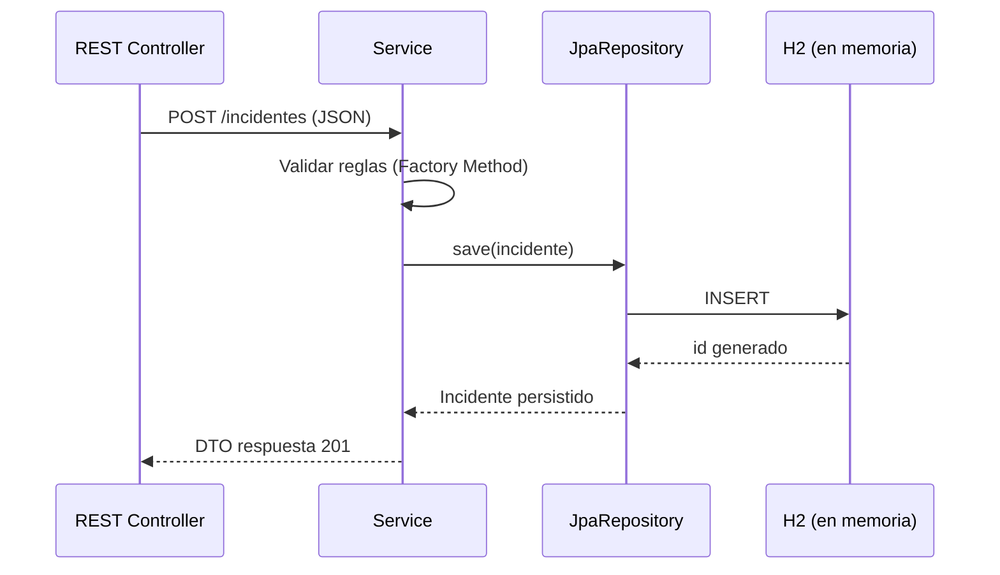
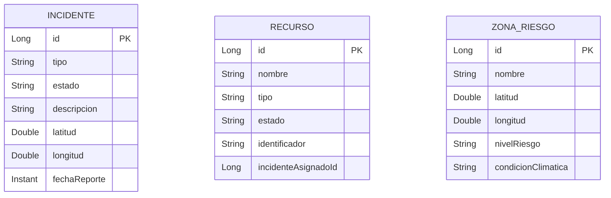

# Persistencia de datos — SRE Valle del Sol (EP3)

**Asignatura:** DSY1106 — Desarrollo Fullstack III  
**Proyecto:** Sistema de Respuesta de Emergencias — Municipalidad Valle del Sol

## 1. Estrategia general

Cada microservicio de dominio mantiene su **propia base de datos lógica** (patrón *Database per Service*). No existen claves foráneas entre servicios: la relación logística se modela con `incidenteAsignadoId` en el microservicio `recursos`.

| Microservicio | Tecnología | Motor | Alcance |
|---------------|------------|-------|---------|
| `incidentes` | Spring Data JPA + Hibernate | H2 en memoria | Entidad `Incidente` |
| `recursos` | Spring Data JPA + Hibernate | H2 en memoria | Entidad `Recurso` |
| `zonasriesgo` | Spring Data JPA + Hibernate | H2 en memoria | Entidad `ZonaRiesgo` |
| `bff` | Sin persistencia propia | — | Agrega DTOs en memoria |

> En desarrollo y demo se usa **H2 en memoria** (`runtime` scope). Los datos se reinician al detener cada microservicio. En un despliegue productivo se reemplazaría H2 por PostgreSQL u otro motor relacional sin cambiar la capa Repository.

## 2. Configuración JPA

Archivo compartido por los tres microservicios (`application.properties`):

```properties
spring.jpa.hibernate.ddl-auto=update
spring.h2.console.enabled=true
```

- **`ddl-auto=update`**: Hibernate crea/actualiza tablas a partir de las entidades `@Entity`.
- **H2 console**: permite inspeccionar tablas en desarrollo (`/h2-console`).

Dependencias heredadas desde `businessdomain/pom.xml`:

- `spring-boot-starter-data-jpa`
- `com.h2database:h2` (runtime)
- `jakarta.persistence-api`

## 3. Capa de persistencia por microservicio

### 3.1 Incidentes

| Elemento | Ubicación |
|----------|-----------|
| Entidad | `entities/Incidente.java` — `@Entity`, `@GeneratedValue`, `EstadoIncidente` enum |
| Repositorio | `repository/IncidenteRepository.java` — `JpaRepository<Incidente, Long>` |
| Servicio | `service/IncidenteService.java` — reglas de negocio + Factory Method de estados |
| API REST | `controller/IncidenteRestController.java` — CRUD + cambio de estado |

### 3.2 Recursos

| Elemento | Ubicación |
|----------|-----------|
| Entidad | `entities/Recurso.java` — tipos `BRIGADA`, `VEHICULO`, `EQUIPO` |
| Repositorio | `repository/RecursoRepository.java` — consultas `findByEstado`, `findByIncidenteAsignadoId` |
| Servicio | `service/RecursoService.java` — asignación solo si `DISPONIBLE` |

### 3.3 Zonas de riesgo

| Elemento | Ubicación |
|----------|-----------|
| Entidad | `entities/ZonaRiesgo.java` — nivel de riesgo, condición climática |
| Repositorio | `repository/ZonaRiesgoRepository.java` — búsqueda por coordenadas con tolerancia |
| Adapter | `adapter/FakeWeatherAdapter.java` — enriquece datos antes de persistir (sin SP) |

## 4. Flujo persistencia en una operación típica



## 5. Evidencia de persistencia en pruebas

Las pruebas de integración verifican que los datos quedan almacenados en H2:

| Módulo | Test | Qué valida |
|--------|------|------------|
| `incidentes` | `IncidenteIntegrationTest.postIncidente_datosValidos_retorna201YPersiste` | POST + lectura desde repository |
| `recursos` | `RecursoIntegrationTest` | Crear, asignar y consultar por incidente |
| `zonasriesgo` | `ZonaRiesgoIntegrationTest` | Crear zona con datos climáticos simulados |

Comando:

```bash
mvn -pl businessdomain/incidentes test -Dtest=IncidenteIntegrationTest
```

## 6. Procedimientos almacenados

No se utilizan stored procedures en esta entrega. Toda la persistencia se resuelve con **JPA/Hibernate** y repositorios Spring Data, alineado con la opción permitida por la pauta EP3 (*JPA y/o SPs*).

## 7. Diagrama entidad-relación simplificado



> `incidenteAsignadoId` es referencia lógica (sin FK cross-database).
